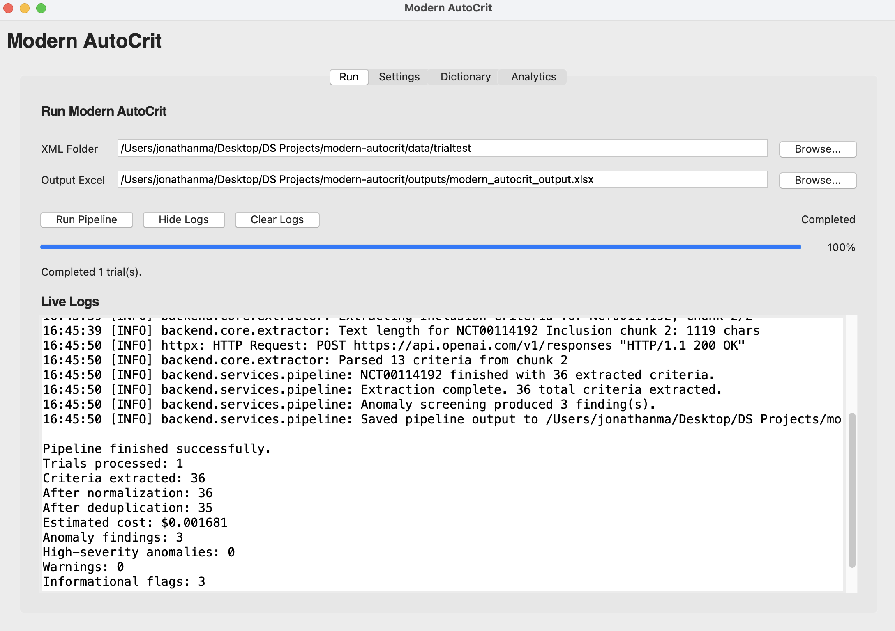
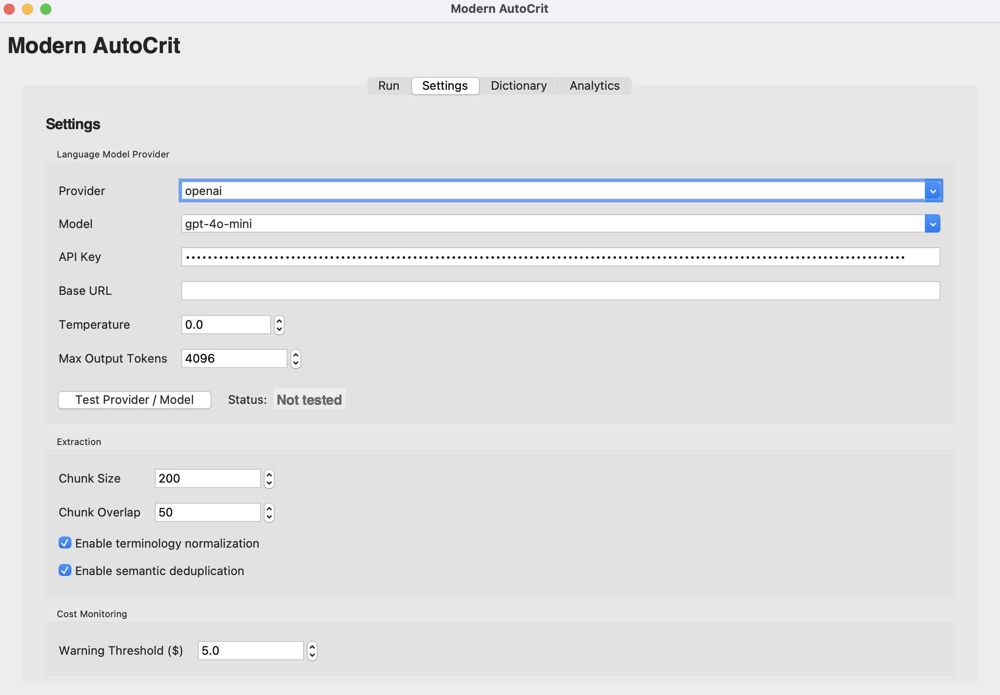
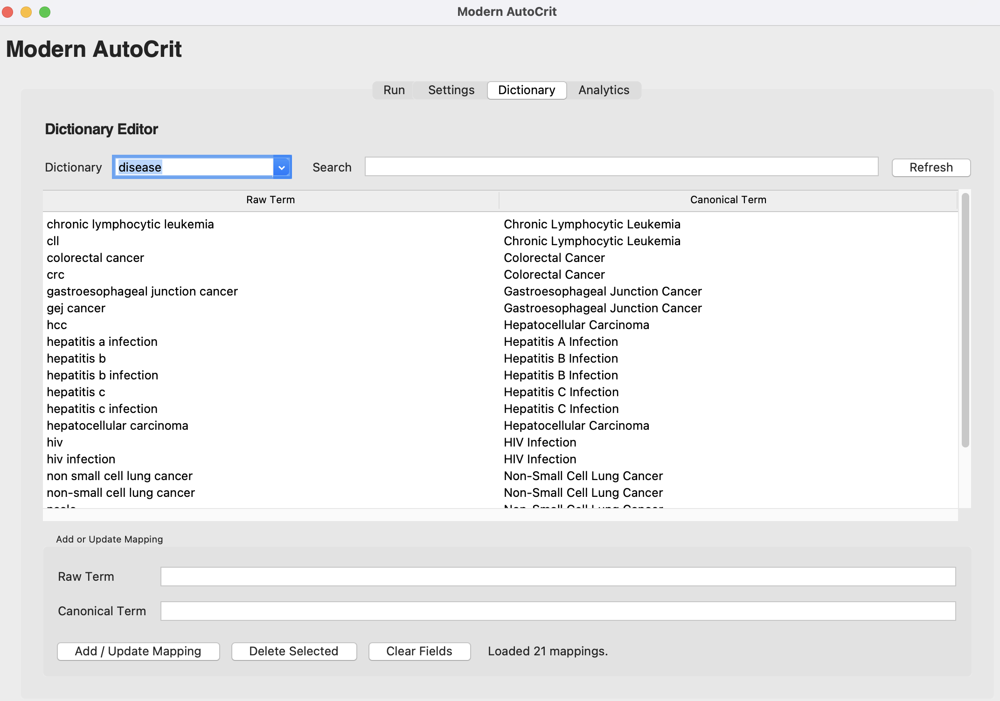
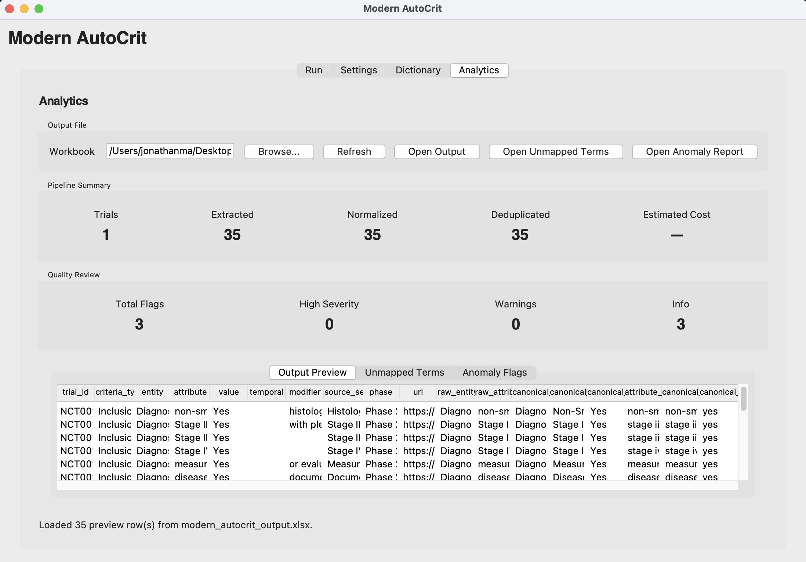

# Modern AutoCrit


## Overview

`modern-autocrit` is a modernization of the [AutoCriteria](https://pubmed.ncbi.nlm.nih.gov/37952206/) clinical trial eligibility criteria extraction workflow.

The goal is to refactor the original AutoCriteria-style pipeline into a cleaner, standalone application that uses the modern OpenAI SDK, removes legacy LangChain dependencies, and adds built-in tools for semantic deduplication and terminology normalization.

Modern AutoCrit is a standalone desktop application for extracting structured eligibility criteria from ClinicalTrials.gov XML files using Large Language Models (LLMs). The application provides an end-to-end workflow for configuring models, running the extraction pipeline, reviewing outputs, and performing quality assurance through anomaly detection and analytics.

The application currently consists of four primary modules:

---

### Run Pipeline

Execute the complete extraction pipeline from a graphical interface.

Features include:

- Select a folder containing ClinicalTrials.gov XML files
- Choose an output directory
- Run extraction without using the command line
- Real-time progress bar
- Live logging window
- Pipeline status updates
- Automatic generation of structured Excel outputs

<p align="center">
  
</p>

--- 

### ⚙️ Settings

Configure the LLM provider and extraction parameters before running the pipeline.

Current functionality includes:

- Select LLM provider (OpenAI, Anthropic, Gemini, Ollama)
- Select model
- Configure API credentials
- Adjust temperature and maximum output tokens
- Configure chunk size and overlap
- Enable or disable terminology normalization
- Enable or disable semantic deduplication
- Configure cost warning thresholds
- Test provider/model availability directly from the application

<p align="center">
  
</p>

---

### Dictionary Management

Inspect and maintain terminology normalization dictionaries used during extraction.

Current capabilities include:

- View entity mappings
- View attribute mappings
- Search existing mappings
- Edit mappings
- Add new terminology
- Save updated dictionaries without modifying source code

This allows domain experts to continually improve terminology normalization as new trials are processed.

<p align="center">
  
</p>

---

### Analytics & Quality Control

Review extraction outputs and perform automated quality assessment.

Current analytics include:

- Pipeline summary statistics
- Cost estimates
- Preview of extracted criteria
- Preview of unmapped terms
- Automated anomaly detection
- Quality-control reports for suspicious measurements and terminology
- Quick access to generated Excel outputs

Anomaly detection currently identifies:

- Implausible numeric measurements
- Unit mismatches
- Suspicious dosage values
- Placeholder or malformed terminology
- Missing or incomplete extracted values

<p align="center">
  
</p>

---

## Goals

- Modernize the AutoCriteria extraction workflow.
- Replace legacy LangChain-based components with the modern OpenAI SDK.
- Provide a standalone desktop application interface.
- Support clinical trial eligibility criteria extraction from ClinicalTrials.gov records.
- Add semantic deduplication for repeated or overlapping extracted criteria.
- Add terminology normalization for mapping raw extracted terms to canonical concepts. Unmapped concepts get returned as well
- Provide configurable settings for output paths, model selection, API key management, and dictionary mappings.
- Deterministic mapping for terminology and semantic cleaning
- Multi-Model support and testing of integration

## Planned Features

- ClinicalTrials.gov trial download support.
- Modern eligibility criteria extraction pipeline.
- Structured criteria output.
- Cost monitoring utilities.
- Agentic Benchmarking and Evaluation of extraction

---

## Requirements

- Python 3.12 (recommended)
- OpenAI API key (or another supported LLM provider)
- macOS, Linux, or Windows

## Usage

### 1. Clone the Repository

```bash
git clone https://github.com/<your-username>/modern-autocrit.git
cd modern-autocrit
```

---

### 2. Create a Virtual Environment

**macOS / Linux**

```bash
python3 -m venv .venv
source .venv/bin/activate
```

**Windows (PowerShell)**

```powershell
python -m venv .venv
.venv\Scripts\Activate.ps1
```

---

### 3. Install Dependencies

Upgrade pip (recommended):

```bash
python -m pip install --upgrade pip
```

Install the required packages:

```bash
pip install -r requirements.txt
```

---

### 4. Configure API Access

Create a `.env` file in the project root:

```text
OPENAI_API_KEY=your_api_key_here
```

Alternatively, API keys can be entered from the **Settings** tab when using the desktop application.

---

## Running Modern AutoCrit

### Option 1 — Desktop Application (Recommended)

Launch the full graphical application:

```bash
python main.py
```

The application provides four tabs:

- **Settings** – Configure API provider, model, and extraction settings.
- **Run Pipeline** – Execute the extraction pipeline.
- **Analytics** – Review extraction summaries, unmapped terms, and anomaly reports.
- **Benchmark** – Compare models and extraction performance.

---

### Option 2 — Backend Pipeline Only

Run the extraction pipeline directly without launching the GUI:

```bash
python run_pipeline.py
```

This reads the configured XML directory, processes all trials, and writes the results to the `outputs/` directory.

---

## Input Data

Place ClinicalTrials.gov XML files inside:

```text
data/xml_trials/
```

Example:

```text
data/
└── xml_trials/
    ├── NCT00114192.xml
    ├── NCT00895128.xml
    └── ...
```

---

## Output Files

Successful runs generate:

```text
outputs/
├── modern_autocrit_output.xlsx
├── modern_autocrit_output_unmapped_terms.xlsx
└── modern_autocrit_output_anomalies.xlsx
```

where:

- **modern_autocrit_output.xlsx** contains the extracted structured eligibility criteria.
- **modern_autocrit_output_unmapped_terms.xlsx** lists attributes that could not be normalized.
- **modern_autocrit_output_anomalies.xlsx** contains automatically flagged measurement, terminology, and quality-control anomalies for manual review.