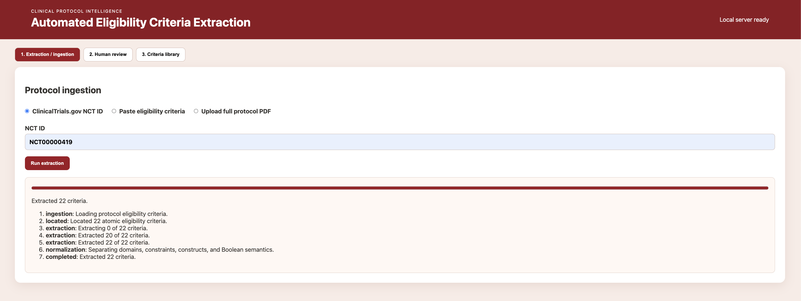
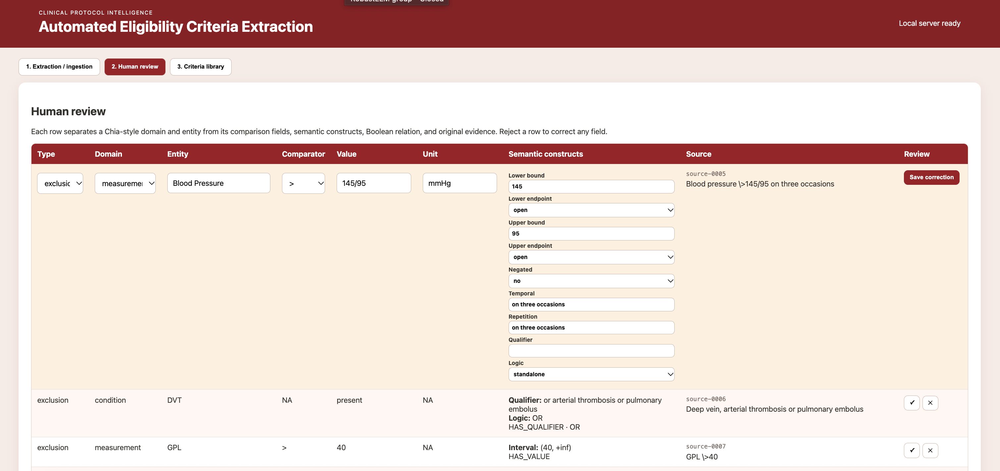
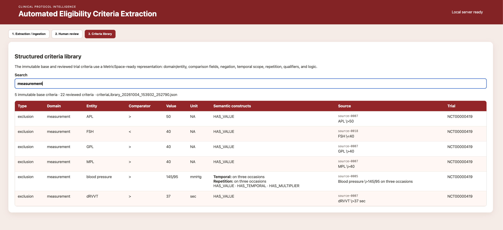

# Automated Eligibility Criteria Extraction

A local browser application that converts protocol eligibility text into
human-reviewed, validated structured criteria for analysis and reuse.

## Workflow

1. Choose ClinicalTrials.gov ingestion by NCT ID, paste eligibility criteria,
   or upload a complete protocol PDF. PDF ingestion locates eligibility sections
   and excludes downstream SAP/SOA content from extraction.
2. Run structured extraction. A progress bar reports ingestion, extraction,
   canonical normalization, completion, or failure.
3. Sort and review Chia-inspired fields: inclusion/exclusion, clinical domain,
   entity, comparator, value, unit, negation, temporal scope, repetition,
   qualifier, Boolean logic, and source provenance.
4. Accept correct rows. Rejecting a row opens its editable fields; saving the
   correction marks it accepted.
5. Apply all reviewed rows. The application writes cumulative timestamped
   `criteriaLibrary_YYYYMMDD_HHMMSS_microseconds.json` and `.csv` snapshots under
   both `runtime/criteria/libraries/` and `config/`. Generated config snapshots are
   ignored by Git; the packaged base remains immutable.
6. Download the frozen **validated JSON** export. Only human-reviewed rows
   with complete provenance and no blocking validation errors are included.

Numerical restrictions retain their literal components. For example:

- `GPL > 50` becomes Domain `measurement`, Entity `GPL`, Comparator `>`,
  Value `50`.
- `blood pressure > 145/95 on three occasions` becomes Domain `measurement`,
  Entity `blood pressure`, Comparator `>`, Value `145/95`, and Repetition
  `on three occasions`.
- `aged 18 to 65` becomes Domain `person`, Entity `Age`, lower bound `18`
  inclusive, upper bound `65` inclusive, unit `years`, and interval `[18, 65]`.

Equivalent range forms such as `between 18 and 65 years`, `18–65 years of
age`, and `age >=18 and <=65 years` normalize to the same closed interval.
Single-sided comparisons also expose their corresponding open or closed bound,
which supports exact overlap, subset, superset, and disjointness calculations.

Categorical restrictions use the explicit values `present` and `absent`, with
negation stored separately. Temporal restrictions, repetition, qualifiers,
AND/OR relations, inclusion/exclusion, and verbatim source text remain distinct.
The distinction between clinical domains, value fields, semantic constructs,
and relations is adapted from the
[Chia clinical-trial eligibility corpus](https://www.nature.com/articles/s41597-020-00620-0).
The project uses a compact JSON/CSV projection rather than a full annotation-graph compatibility.

The packaged [base criteria library](config/base_criterion_library.json) is read-only.
Only timestamped generated snapshots receive reviewed additions.
Canonical aliases are governed in
[terminology_normalization.json](config/terminology_normalization.json).
That configuration includes the legacy attribute and disease maps, translates
the legacy entity-class map into Chia domains, and adds frequently encountered
oncology diseases, performance measures, laboratory terms, response concepts,
and biomarkers. Ambiguous short oncology abbreviations are exact-match only so
ordinary words such as “all” are not rewritten inside sentences.

The extractor retains the useful core of the original AutoCriteria workflow:
source-bounded prompting, separate inclusion/exclusion processing, clinical
entity-class guidance, one clinical concept per output row, and verbatim source
provenance. This implementation replaces its LangChain/pandas script with the
project's OpenAI SDK adapter, strict JSON schema, deterministic post-processing,
persisted job records, and mandatory human review.

## Teammate setup and execution

Prerequisites:

- Python 3.12 or newer
- an OpenAI API key with access to the model selected in
  `config/default_settings.json`
- internet access for model calls and ClinicalTrials.gov ingestion

Clone the project and enter its root directory:

```bash
git clone https://github.com/JonathanMa03/modern-autocrit.git
cd modern-autocrit
```

Create the environment and install dependencies on macOS or Linux:

```bash
python3 -m venv .venv
source .venv/bin/activate
python -m pip install -r requirements.txt
```

On Windows PowerShell:

```powershell
py -m venv .venv
.venv\Scripts\Activate.ps1
python -m pip install -r requirements.txt
```

Create `.env` in the repository root:

```text
OPENAI_API_KEY=your_api_key_here
```

Start the backend and browser UI with one command:

```bash
python main.py
```

The command starts both the backend and frontend and normally opens
[http://127.0.0.1:8765](http://127.0.0.1:8765). Keep that terminal open while
using the application. Stop it with `Ctrl+C`.

Useful alternatives:

```bash
# Start without opening a browser automatically
python main.py --no-browser

# Use a different port if 8765 is occupied
python main.py --port 9000
```

The API key stays on the local backend and is never entered into the browser.

## Running an extraction

1. Open **Extraction / ingestion**.
2. Choose one input mode:
   - **ClinicalTrials.gov NCT ID** retrieves the registered eligibility text.
   - **Paste eligibility criteria** accepts local or draft inclusion/exclusion
     text.
   - **Upload full protocol PDF** accepts a text-based complete protocol and
     extracts only recognizable eligibility sections.
3. Select **Run extraction** and follow the progress log. It reports how many
   source criteria were located and how many have been processed.
4. In **Human review**, sort rows by their headers. Select ✓ to accept a row or
   ✕ to edit it. Saving a correction counts as acceptance.
5. After every row is reviewed, select **Apply reviewed criteria to library**.
6. Use **Criteria library** to search the immutable examples and latest reviewed
   trial criteria. Select **Download Excel spreadsheet** to export the complete
   current library for labeling or analysis. **Reset reviewed library** removes
   generated review snapshots after confirmation and restores the display to the
   immutable examples.

## Recoverable cohort extraction

The packaged research cohort contains 50 oncology and 50 cardiovascular trials.
Validate it without making network or model calls, then start or resume it with:

```bash
./scripts/run_trial_cohort.py --dry-run
./scripts/run_trial_cohort.py
```

Use `./scripts/run_trial_cohort.py --yes` for an unattended run. The command
prints trial-level progress and continues past terminal failures after the
configured retries. It incurs ClinicalTrials.gov traffic and model API cost.
Its stable `cohort_id` preserves completed jobs when metadata is corrected or
the manifest is otherwise revised.

For a different cohort, copy `config/trial_manifest.example.json`, replace its
NCT IDs, and run:

```bash
python main.py --manifest path/to/trial_manifest.json
```

The runner processes trials sequentially and stores manifest state under
`runtime/criteria/manifests/`. Each completed model batch is checkpointed inside
its job record. Re-running the same command skips completed trials and resumes
interrupted or failed jobs from the last completed batch. After the jobs finish,
open the browser application normally to review their criteria. Model completion
does not make a criterion export-ready; human review is still required.

## Feature-freeze and downstream handoff

Modern AutoCrit's intended extraction scope is now complete. To create a
versioned structured-criteria dataset for any downstream analysis:

1. Freeze the oncology and cardiovascular NCT manifest.
2. Run `python main.py --manifest <manifest.json>` until every trial is completed
   or has a documented terminal failure.
3. Start `python main.py`, open each saved completed job, and review every atom.
4. Correct all blocking validation findings and apply each reviewed trial.
5. Download the Excel library for cohort-level quality control and spot checks.
6. Download the validated JSON and archive it with the manifest, Git commit,
   schema file, and a dataset version label.
7. Treat that frozen export—not mutable runtime files—as the downstream input.

Project-specific pair construction, distance logic, embedding models, LLM
comparison, fine-tuning, and evaluation should live in their downstream project,
not in the general-purpose Modern AutoCrit extractor. MetricSpace is one such
consumer, but it is not required to run or understand Modern AutoCrit.

## Interface








## Outputs

### Structured review rows

Each extracted row provides:

| Field | Meaning |
| --- | --- |
| `criterion_type` | Inclusion or exclusion polarity from the protocol section. |
| `domain` | Chia-style domain: observation, condition, person, device, drug, visit, procedure, or measurement. |
| `entity` | Canonical clinical concept without its threshold or modifier. |
| `comparator`, `value`, `unit` | Literal quantitative or categorical constraint components. |
| `lower_bound`, `upper_bound` | Nullable numerical endpoints for exact downstream comparison. |
| `lower_inclusive`, `upper_inclusive` | Whether each endpoint is closed. |
| `interval` | Readable representation such as `[18, 65]` or `(18, +inf)`. |
| `negated` | Whether absence of the entity is required. |
| `temporal` | Time window separated from the entity. |
| `repetition` | Frequency or multiplicity, such as `on three occasions`. |
| `qualifier` | Severity, exception, or other clinically material modifier. |
| `logical_operator` | Standalone, AND, or OR relationship for concepts from a shared source. |
| `relations` | Derived graph-based labels such as `HAS_VALUE` and `HAS_TEMPORAL`. |
| `source_id`, `source` | Stable provenance identifier and verbatim protocol evidence. |
| `criterion_id`, `parent_statement_id` | Content-derived stable identifiers for the atom and its source statement. |
| `protocol_id`, `source_version`, `source_uri` | Protocol identity, registry/document version, and retrieval location. |
| `surrounding_context` | Parent statement and adjacent eligibility context retained for interpretation. |
| `boolean_group_id`, `parent_atom_count`, `atom_index` | Explicit membership and order within an AND/OR statement. |
| `extraction_confidence` | Model confidence in its extraction; never treated as human approval. |
| `human_review_status` | `pending`, `accepted`, or `corrected`. |
| `validation_issues` | Automated source-consistency checks with codes, fields, severity, and messages. |
| `export_ready`, `readiness_blockers` | Validated-export flag and explicit reasons a row is withheld. |

### Files created

- `runtime/criteria/jobs/<job_id>.json` contains status, progress events,
  errors, and completed review rows for one submission.
- `runtime/criteria/libraries/criteriaLibrary_<datetime>.json` is the
  authoritative local reviewed snapshot.
- `runtime/criteria/libraries/criteriaLibrary_<datetime>.csv` is its tabular
  export.
- Matching JSON and CSV snapshots are written under `config/` so the currently
  reviewed library is available to the application. Generated snapshots are
  ignored by Git.
- `/api/library.xlsx`, exposed through the Criteria Library download button,
  generates an Excel workbook containing the immutable base and current reviewed
  rows. It includes filtering, frozen headers, source evidence, normalized fields,
  and a separate field-guide worksheet.
- `/api/validated-export.json` writes and downloads a JSON document conforming
  to `backend/schemas/validated_criteria_v1.schema.json`. It excludes base
  examples, pending reviews, incomplete provenance, and structurally invalid
  criteria.
- `/api/library/reset` removes generated JSON/CSV library snapshots from runtime
  storage and `config/`. It does not remove extraction job records, unrelated
  files, or `config/base_criterion_library.json`.
- `config/base_criterion_library.json` is the packaged, immutable seed library.
  Its `EXAMPLE` rows include numerical boundaries, sex-wording equivalence,
  ambiguous investigator discretion, temporal and repeated measurements,
  clinical exceptions, and compound OR criteria.
- `config/terminology_normalization.json` contains governed aliases, oncology
  terminology, exact-only abbreviations, and legacy-class-to-domain mappings.

Reviewed library snapshots use schema `modern-autocrit.structured-criteria.v4`.
The frozen downstream handoff uses
`modern-autocrit.validated-criteria.v1`.
Historical `eavLibrary_*.json` files are read through an in-memory compatibility
upgrade and are not modified.

### Automated validation

Before a reviewed row can enter the validated export, Modern AutoCrit checks:

- comparators, bounds, and reversed intervals;
- negation/value consistency;
- measurement units present in the source but absent from the structure;
- temporal and repetition language omitted from their fields;
- multi-atom parent statements without AND/OR scope; and
- possible compound statements that remain unsplit.

Errors block readiness. Warnings remain visible for review but do not by
themselves block export. Human acceptance or correction is always required.

## Operational notes

- The PDF reader requires selectable text and does not perform OCR.
- A failed model batch leaves prior batches checkpointed. Manifest runs retry and
  resume automatically; the API also exposes a resume operation for saved jobs.
- Never commit `.env`, `runtime/`, uploaded protocols, or generated library
  snapshots.
- If startup reports “address already in use,” stop the prior process or use a
  different `--port`.
- Model output must be reviewed; it is not clinical ground truth.

## Architecture

```text
main.py                               launcher
webapp/server.py                      HTTP API and static-file server
webapp/static/                        three-panel browser interface
backend/eav_pipeline.py               segmentation and Chia-inspired semantic normalization
backend/criterion_validation.py       validation findings and export readiness
backend/batch_manifest.py             recoverable cohort extraction
backend/services/eav_workflow.py      jobs, retries, progress, review, JSON/CSV/Excel output
backend/services/ctgov_v2_service.py  ClinicalTrials.gov v2 retrieval
backend/services/llm/                 OpenAI SDK boundary
config/base_criterion_library.json    immutable packaged seed library
backend/schemas/validated_criteria_v1.schema.json  frozen handoff contract
runtime/criteria/                     ignored local jobs and reviewed snapshots
```

## Testing

```bash
python -m pytest -q
```

Model output is always subject to human review and is not clinical ground truth.
